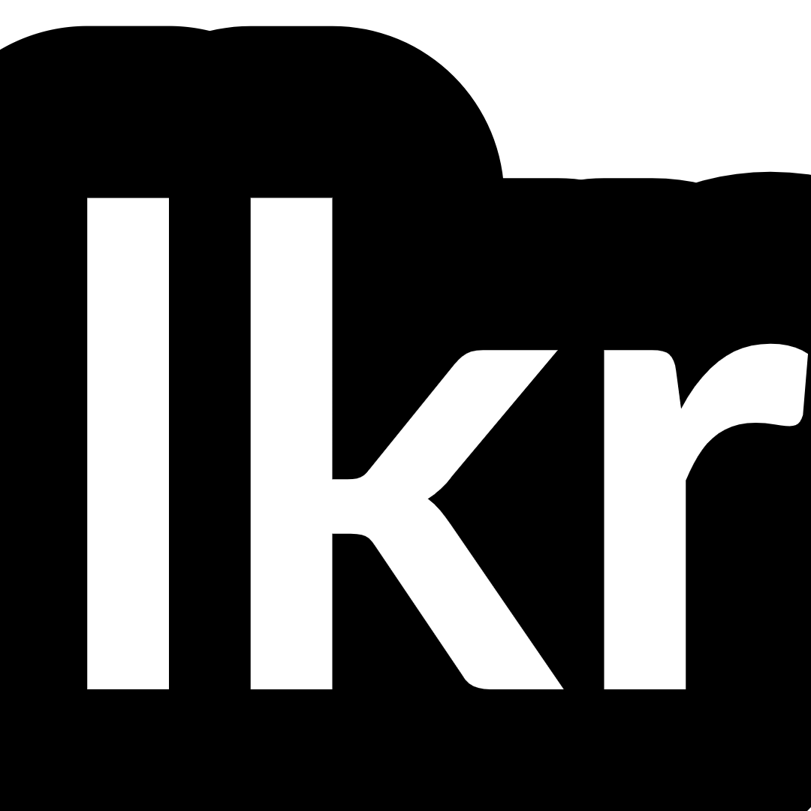

# Linkr (Front-end) 


##### Neste repositório você encontrará a interface de usuário para a aplicação Linkr, uma plataforma de compartilhamento e descoberta de links. Este repositório contém o código-fonte do front-end do projeto.

##### Algumas tecnologias usadas no projeto: *React, Styled-Components, Axios, jsonWebToken*.
<br />


### Visão Geral

O Linkr é uma plataforma que permite aos usuários compartilhar e descobrir links interessantes. Com o frontend do Linkr, os usuários podem navegar pelos links compartilhados por outros usuários, adicionar seus próprios links e interagir com a comunidade, seguindo outros usuários, curtindo seus posts e comentando, além, é claro, de poder compartilhar suas publicações com sua própria rede.

Este projeto foi construído em colaboração entre:

- [Diego Becker](https://github.com/DiegoBeker)
- [Felipe Iasbik](https://github.com/felipeiasbik)
- [Filipe Tenedini](https://github.com/filipetenedini)
- [Jhonathan Carvalho](https://github.com/csjhonathan)

### Principais recursos:

- Registro e login de usuários;
- Página inicial com os links mais recentes;
- Trending, onde o usuário pode ver a lista de tags(#) mais populares;
- Feed personalizado, onde o usuário vê somente os posts dos usuários que segue;
- Pesquisa de usuários pelo nome;
- Adição e edição de links;
- Perfil de usuário com informações pessoais e links compartilhados.

Para ver como ficou o projeto, basta acessar o link: [Linkr](https://linkr-frontend-delta.vercel.app/)

Vale a ressalva de que o acesso pode ser um pouco lento devido ao backend estar hospedado em uma plataforma gratuita. Mas tenha paciência :)

### Como utilizar:
- Clone o repositório
- Digite o seguinte comando na raíz do projeto:

  ```
  npm i
  ```
- Crie um arquivo .env
- Crie uma variável de ambiente chamada REACT_APP_API_URL e utilize a nossa API pública.
- O seu arquivo .env deverá ficar da seguinte forma:

```
REACT_APP_API_URL=https://linkr-api-28og.onrender.com
```

### OBRIGADO PELA VISITA :D
